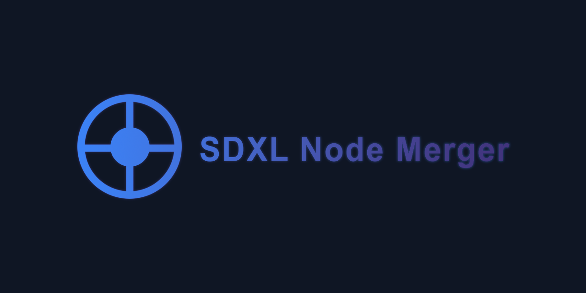
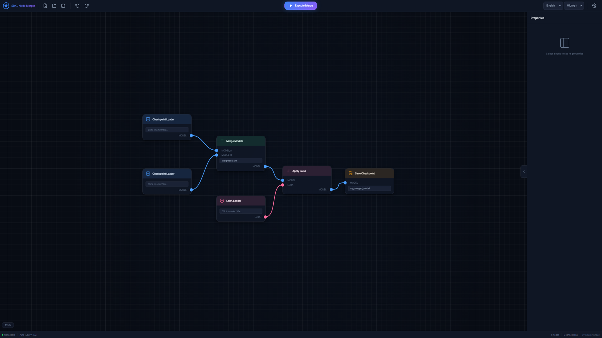
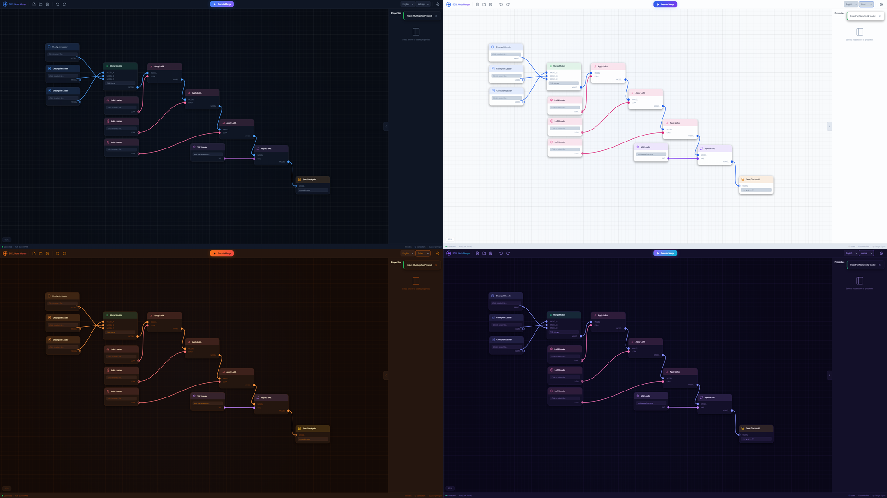
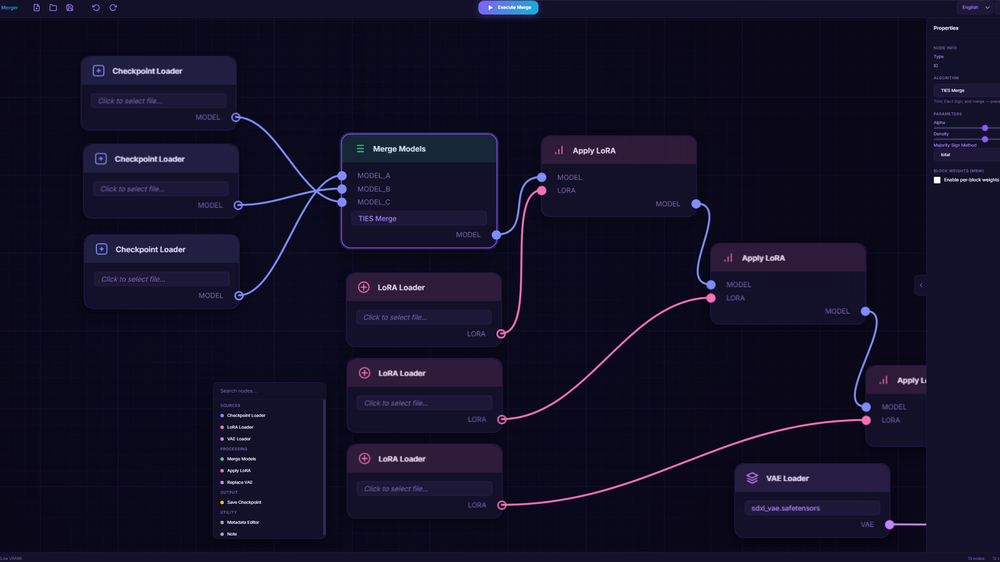
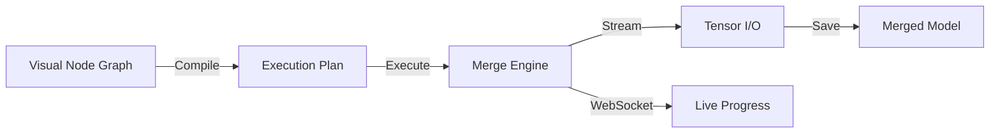

<p align="center">
  <!-- Replace with your own banner image -->
  
</p>

<h1 align="center">🧬 SDXL Node Merger</h1>

<p align="center">
  <strong>A visual, node-based model merging tool for Stable Diffusion XL</strong>
</p>

<p align="center">
  <a href="#features">Features</a> •
  <a href="#installation">Installation</a> •
  <a href="#usage">Usage</a> •
  <a href="#algorithms">Algorithms</a> •
  <a href="#keyboard-shortcuts">Shortcuts</a> •
  <a href="#architecture">Architecture</a> •
  <a href="#contributing">Contributing</a>
</p>

<p align="center">
  
  
  
  <a href="LICENSE"></a>
</p>

---

## ✨ What is SDXL Node Merger?

**SDXL Node Merger** is a professional-grade, browser-based tool that lets you merge Stable Diffusion XL models using an intuitive **node-graph interface** — similar to ComfyUI or Blender's shader nodes, but designed exclusively for model merging.

Instead of writing scripts or using CLI tools, you simply **drag, drop, and connect nodes** to build complex merge workflows visually. The tool handles everything from simple weighted merges to advanced multi-model fusion with per-block weight control.

<p align="center">
  <!-- Replace with a screenshot of the main interface -->
  
  <br>
  <em>The node-based visual editor with live Bezier connections</em>
</p>

---

<a id="features"></a>

## 🎯 Features

### 🖥️ Visual Node Editor
- **Drag-and-drop** node creation with double-click quick-add menu
- **SVG Bezier curves** with smooth animated connections
- **Infinite canvas** with zoom (15%–300%) and pan navigation
- **Undo/Redo** support with full state history
- **Project save/load** — pick up right where you left off

### 🧠 17 Merge Algorithms
- Weighted Sum, Add Difference, Tensor Sum, SLERP
- **TIES**, **DARE**, and **TIES-DARE Hybrid**
- Spectral Merge, Orthogonal Projection, Geometric Median 
- And more — see [full list](#algorithms)

### 🎛️ Merge Block Weighted (MBW)
- Per-block weight control for SDXL architecture
- Fine-tune each U-Net block independently
- Presets for common configurations

### ⚡ Performance
- **Low VRAM mode** — streams tensors one-by-one, works with 4GB+ GPU
- **CUDA 12.x** support including RTX 50-series GPUs
- Real-time progress tracking via WebSocket
- Optimized `.safetensors` I/O

### 🎨 Premium Interface
- **4 built-in themes**: Midnight, Aurora, Ember, Frost
- **Glassmorphism** dark UI with smooth micro-animations
- **i18n support**: English and Russian (extensible)
- Responsive layout with collapsible sidebar

<p align="center">
  <!-- Replace with a screenshot showing different themes -->
  
  <br>
  <em>Four built-in color themes</em>
</p>

---

<a id="installation"></a>

## 📦 Installation

### Prerequisites

- **Python 3.10+** (3.12 or 3.13 recommended)
- **GPU with CUDA support** (recommended, CPU works but is slower)
- **4 GB+ VRAM** (8 GB+ recommended for normal mode)

### Quick Start

1. **Clone the repository**:
   ```bash
   git clone https://github.com/georgebanjog/sdxl-node-merger.git
   cd sdxl-node-merger
   ```

2. **Run the launcher**:
   
   **Windows:**
   ```bash
   start.bat
   ```

   The launcher will automatically:
   - Create a Python virtual environment
   - Install PyTorch with CUDA support
   - Install all dependencies
   - Start the server

3. **Open in browser**:
   ```
   http://127.0.0.1:8765
   ```

> [!TIP]
> The first launch may take 5-10 minutes to install PyTorch and dependencies. Subsequent launches are instant.

### Manual Installation

If you prefer manual setup:

```bash
# Create virtual environment
python -m venv .venv

# Activate it
# Windows:
.venv\Scripts\activate
# Linux/macOS:
source .venv/bin/activate

# Install PyTorch (CUDA 12.8 — for RTX 50-series and modern GPUs)
pip install torch --index-url https://download.pytorch.org/whl/cu128

# Install dependencies
pip install safetensors websockets packaging numpy

# Start the server
python server.py
```

---

<a id="usage"></a>

## 🚀 Usage

### Basic Merge Workflow

<p align="center">
  <!-- Replace with a workflow diagram or screenshot -->
  
</p>

1. **Configure directories** — Click ⚙️ Settings and set your model paths:
   - Checkpoints directory (where your `.safetensors` models live)
   - Output directory (where merged models are saved)

2. **Add model loaders** — Double-click the canvas to open the quick-add menu, then:
   - Add **Checkpoint Loader** nodes for each input model
   - Select the model file from the dropdown

3. **Add a merge node** — Add a **Merge Models** node and choose your algorithm

4. **Connect nodes** — Drag from output ports (right side) to input ports (left side):
   - Connect Model A and Model B to the merge node
   - Connect the merge output to a **Save Checkpoint** node

5. **Configure & execute** — Set merge parameters in the sidebar, then click **▶ Execute Merge**

### Node Types

| Node | Description | Ports |
|------|-------------|-------|
| 🔹 **Checkpoint Loader** | Loads a `.safetensors` model | Out: MODEL |
| 🔸 **LoRA Loader** | Loads a LoRA file | Out: LORA |
| 🟣 **VAE Loader** | Loads a VAE file | Out: VAE |
| 🟢 **Merge Models** | Merges 2-3 models | In: MODEL_A, MODEL_B, (MODEL_C) → Out: MODEL |
| 🔸 **Apply LoRA** | Applies LoRA to a model | In: MODEL, LORA → Out: MODEL |
| 🟣 **Replace VAE** | Swaps the VAE in a model | In: MODEL, VAE → Out: MODEL |
| 🟡 **Save Checkpoint** | Saves the result to disk | In: MODEL |
| 📝 **Metadata Editor** | Edits model metadata | In: MODEL → Out: MODEL |
| 📌 **Note** | Sticky note for documentation | — |

---

<a id="algorithms"></a>

## 🧬 Algorithms

| Algorithm | Models Required | Description |
|-----------|:-:|-------------|
| **Weighted Sum** | 2 | `A * (1 - α) + B * α` — Simple linear interpolation |
| **Add Difference** | 3 | `A + (B - C) * α` — Transfer style from B relative to C |
| **Sum** | 2 | `A + B * α` — Add model B scaled by alpha |
| **Tensor Sum** | 2 | Weighted sum with optional normalization |
| **TIES Merge** | 3 | TrIm, Elect Sign, and merge — preserves important weights |
| **DARE Merge** | 3 | Drop And REscale — randomly drops deltas with rescaling |
| **Cosine Merge** | 2 | Adaptive merging based on cosine similarity between tensors |
| **Train Difference** | 3 | Extract training delta with optional clipping |
| **Distribution Merge** | 2 | Align statistical distributions (mean and variance) between models |
| **Smoothed Add Difference** | 3 | Add Difference with Gaussian smoothing on deltas |
| **Multiply Difference** | 2 | Scale model weights multiplicatively: `A × (1 + (B/A - 1) * α)` |
| **SLERP** | 2 | Spherical Linear Interpolation — better preserves variance than linear merge |
| **Task Arithmetic** | 3 | Model arithmetic adding independent task vectors: Base + (A-Base) + (B-Base) |
| **Geometric Median** | 3 | Calculates exact median element-wise between 3 source models |
| **TIES-DARE Hybrid** | 3 | Synergizes DARE (drop/rescale) and TIES (trim/elect/merge) |
| **Orthogonal Projection** | 3 | Vector orthogonal projection of flattened deltas (eliminates conflicts) |
| **Spectral Merge** | 2 | Applies flattened 1D FFT to separate high/low frequencies |

> [!NOTE]
> All algorithms support **Merge Block Weighted (MBW)** mode, allowing per-block α values for fine-grained control over the SDXL U-Net architecture.

---

<a id="keyboard-shortcuts"></a>

## ⌨️ Keyboard Shortcuts

| Shortcut | Action |
|----------|--------|
| `Double-click` canvas | Quick-add node menu |
| `Right-click` drag | Pan the canvas |
| `Scroll wheel` | Zoom in/out |
| `Middle-click` connection | Delete connection |
| `Ctrl + Z` | Undo |
| `Ctrl + Y` | Redo |
| `Ctrl + S` | Save project |
| `Delete` | Remove selected node(s) |

---

<a id="architecture"></a>

## 🏗️ Architecture

```
sdxl-node-merger/
├── server.py              # Main HTTP + WebSocket server
├── config.json            # User configuration (auto-generated)
├── start.bat              # Windows launcher
│
├── engine/                # Backend merge engine
│   ├── graph_compiler.py  # Node graph → execution plan
│   ├── merge_executor.py  # Executes merge steps
│   ├── algorithms.py      # 11 merge algorithms
│   ├── tensor_io.py       # Safetensors I/O + streaming
│   ├── lora_utils.py      # LoRA parsing & application
│   ├── vae_utils.py       # VAE replacement logic
│   └── metadata.py        # Model metadata handling
│
├── web/                   # Frontend (vanilla JS/CSS)
│   ├── index.html         # Main application page
│   ├── css/
│   │   ├── main.css       # Core styles
│   │   ├── nodes.css      # Node component styles
│   │   └── themes.css     # Theme system
│   ├── js/
│   │   ├── app.js         # Application bootstrap
│   │   ├── canvas.js      # Zoom/pan/grid controller
│   │   ├── connections.js # SVG Bezier connections
│   │   ├── nodes.js       # Node creation & management
│   │   ├── sidebar.js     # Properties panel
│   │   ├── toolbar.js     # Top toolbar actions
│   │   ├── api.js         # REST + WebSocket client
│   │   ├── i18n.js        # Internationalization
│   │   ├── themes.js      # Theme manager
│   │   └── project.js     # Project save/load
│   ├── lang/              # Language packs
│   │   ├── en.json
│   │   └── ru.json
│   └── themes/            # Theme definitions
│       ├── midnight.json
│       ├── aurora.json
│       ├── ember.json
│       └── frost.json
│
└── projects/              # Saved project files
    └── Example Merge.json
```

### How It Works



1. **Frontend** — Build your merge workflow visually using the node editor
2. **Graph Compiler** — Validates the graph, detects cycles, and generates a topologically-sorted execution plan
3. **Merge Executor** — Processes each step (load → merge → save) with progress tracking
4. **Tensor I/O** — Handles `.safetensors` files with optional streaming mode for low-VRAM systems
5. **WebSocket** — Sends real-time progress updates back to the browser

---

## 🎨 Themes

SDXL Node Merger comes with 4 built-in themes. You can switch themes from the dropdown in the toolbar.

| Theme | Description |
|-------|-------------|
| 🌙 **Midnight** | Deep dark blues — the default theme |
| 🌌 **Aurora** | Purple and teal gradients |
| 🔥 **Ember** | Warm orange and amber tones |
| ❄️ **Frost** | Cool ice blue and silver |

Custom themes can be added by creating a new `.json` file in `web/themes/`.

---

## 🌍 Localization

The interface supports multiple languages. Currently available:

- 🇬🇧 English
- 🇷🇺 Russian (Русский)

### Adding a New Language

1. Copy `web/lang/en.json` to `web/lang/YOUR_LANG_CODE.json`
2. Translate all string values
3. Restart the server — it will auto-detect the new language file

---

<a id="contributing"></a>

## 🤝 Contributing

Contributions are welcome! Here's how you can help:

1. **Fork** the repository
2. **Create** a feature branch (`git checkout -b feature/amazing-feature`)
3. **Commit** your changes (`git commit -m 'Add amazing feature'`)
4. **Push** to the branch (`git push origin feature/amazing-feature`)
5. **Open** a Pull Request

### Ideas for Contribution

- 🌐 New language translations
- 🎨 Custom themes
- 🧬 New merge algorithms
- 📊 Merge comparison/preview tools
- 🧪 Unit tests and CI/CD

---

## 📋 Requirements

| Component | Minimum | Recommended |
|-----------|---------|-------------|
| Python | 3.10 | 3.12+ |
| VRAM | 4 GB (low-VRAM mode) | 8+ GB |
| RAM | 8 GB | 16+ GB |
| Disk | 20 GB (for models) | SSD recommended |
| GPU | Any CUDA-capable | RTX 30/40/50 series |
| OS | Windows 10+ | Windows 11 |

> [!IMPORTANT]
> Linux and macOS support is planned but not yet tested. The launcher script (`start.bat`) is Windows-only. Manual installation works on all platforms.

---

## 📄 License

This project is licensed under the **Apache License 2.0** — see the [LICENSE](LICENSE) file for details.

---

## 👤 Author

<p align="center">
  <strong>Created by George Kogan</strong>
  <br>
  <!-- Add your links below -->
  <a href="https://github.com/georgebanjog">GitHub</a> •
  <a href="https://www.patreon.com/c/georgebanjog">Patreon</a>
</p>

---

## 🙏 Acknowledgments

- [Stable Diffusion](https://stability.ai/) for the incredible generative AI models
- [SafeTensors](https://github.com/huggingface/safetensors) for the fast, safe model format
- [PyTorch](https://pytorch.org/) for the deep learning framework
- The AI art community for inspiration and merge algorithm research

---

<p align="center">
  <strong>⭐ If this tool helped you, consider giving it a star! ⭐</strong>
</p>
